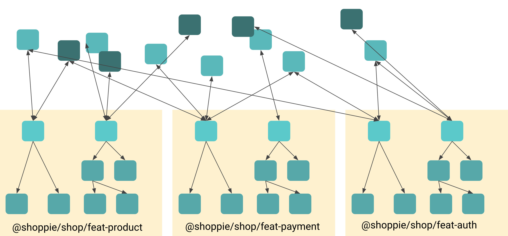
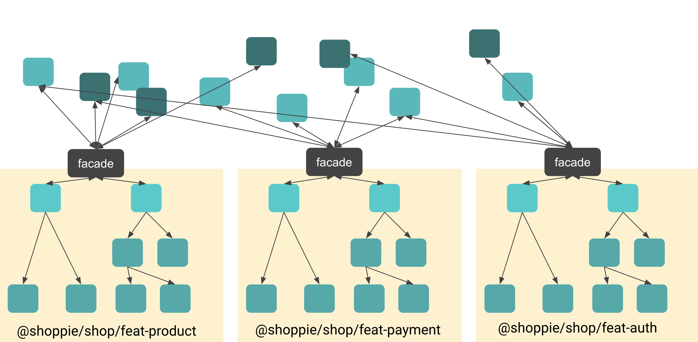

This article is about 2 concepts that we use in our Angular applications.
Since these are architectural principles, they could be applied on other technologies as well.
Whether you are an Angular developer, a React developer or a developer that works in any other
type of component based javascript framework, these
principles should apply for your application as well. The principles explained in this article are called:
- Smart and Dumb components
- Sandbox facades

These principles are explained in this article because they have one thing in common: We use them to keep components ignorant.

## Smart & Dumb components

For the principle of Smart & Dumb components, the goal is to separate our components into 2 groups of components based on their responsibilities.

In one group we have the dumb components which are also called presentational components or ui components.
In the other group we have the smart components which are also called container components or orchestration components.

### What is a dumb component?

A dumb component is stupid in the way that it is ignorent from the rest of the application. 
It doesn't know about the data services that are fetching the data from our apis, nor does it know about how the application handles global state management. Whether data is real-time or not, whether the data comes in through observables our plain javascript objects, the component doesn't know and has only 2 very clear responsibilities:

- It should render its DOM correctly based on data flowing through the `@Input` properties that will come from its parent component.
- It should notify their parent with new possible data, but it should not care what happens with that data.

This is an example of a simple dumb component, that should render the name in the DOM and should notify its parent when the name has changed:

```typescript
@Component({
selector: 'hello',
template: `
    <h1>Hello {{name}}!</h1>
    <input type="text" [(ngModel)]="name" 
        (input)="nameChange.emit(name)">
`,
})
export class HelloComponent  {
    @Input() name: string;
    @Output() nameChange = new EventEmitter<string>()
}

```

Notice that these components usually don't have any dependencies injected into them.

There are some other things that a dumb component should never do:
- It should never communicate with the rest of the application.
- It should never mutate data, it's not its responsibility.
- It should never call to external state that is not passed by `@Input` properties. However, it can manage its own state.

A dumb component **can** however contain complex logic. It does not mean that because we call them dumb components that they can't contain complexities. For instance a calendar's month view would have to calculate leap years, starting the week from monday instead of sunday and would have calculate an amount of week rows to show dependening on the month.

Even though that complexities can be part of those components, this month view should never fetch data itself. That would be the responisiblity of the smart components.

What are the benefits of dumb components?
- They are easy to test
- They are easy to reuse
- It follows the separation of concerns principle
- It makes it easier to follow the dataflow and find bugs in the application

### What is a smart component?

A smart component will orchestrate. It would initiate XHR calls and state management. When data is being fetched it would pass that data to its dumb components that would have their own responsibility in presenting that data.
Smart components would also trigger route changes Eg: when a POST call succeeds.

Smart components would have dependencies injected into them because they need those dependencies to orchestrate:
A simple example can be found below: We pass the name from the smart component to the dumb `hello` component that will notify the smart component when it's changed, and when we click on the save button the smart component will use the `nameService` to save the name, and navigate away on success:

```typescript
@Component({
selector: 'name',
template: `
    <hello name="{{ name }}" (nameChange)="name=$event"></hello>
    <button (click)="save()">Save</button>
`
})
export class NameComponent  {
  private readonly nameService = inject(NameService);
  name = 'Brecht';

  public save(): void {
    this.nameService.save(this.name).then(() =>{
      this.router.navigate(['..'])
    })
  }
}

```

## Sandbox facades

Smart components usually live in feature libraries. Feature libraries are Angular modules or libraries 
(usually behind a barrel file) that contain presentation logic rather than pure ui logic. 
Smart components have a big responsibility there: **They should orchestrate!** This means they should consume different
parts of the code base and call functions on them, consume state from them, etc.
But that's kind of a big responsibility, to orchestrate with the rest of the application, it should know all
the services and more importantly, have access to them. That might not be the best idea.
In the following image we see 3 feature libraries that consume whatever the want from within the code base:



The same goes for kids. You don't want them to access everything in your garden, there might be dangerous tools lying around in there.
When you put your kid in a sandbox in that garden, it knows it can play with little buckets, shovels and all the other
toys that its sandbox has to offer. The responsibility of your kid is now limited and he or she is safe, and can prosper by doing what he
or she is meant to do. You as a parent, shouldn't worry about them taking your lawn mower or heg saw.

The same goes for smart components: We want to keep them ignorant in a way too.
We don't want them to inject services from wherever they want in the code base. We don't want them to call state actions or selectors.
Smart components shouldn't even know how state is being managed in the codebase, and they definitely shouldn't know which framework the codebase uses.

A sandbox facade will help with that. It's an injectable that only exposes the functions and observables that feature would need.
It would become the **api** of that feature, and it would be very easy to do what that feature can consume from the rest of the codebase.

Every feature would have **one and only one sandbox facade** and the code in there could be seen as redundant. 
That's totally fine because this facade
**can not contain any logic**. It can only contain orchestration code.
The goal is that the feature library can not consume **anthing** unless it is exposed through its sandbox facade.

This is illustrated in the following image:



### What can a sandbox facade do?

- It can expose observables from state services, or even use state selectors
- It can expose public functions from services and orchestrate

### What can't a sandbox facade do?

- It can not hold state, it **can** expose state by passing it from somewhere else
- It can not contain any RxJS operators (that would be logic, no `map()`, no `shareReplay(1)`)
- It can not call multiple calls in one function: It should only expose things

Why can't it do those things? Because that would result in the urge to share sandbox facades and that would introduce
a whole new level of complexity. They would lose their purpose. Having logic in there would result in redundant logic,
and that is not what we want.

The goal of this facade is to make the smart component ignorant as well. It's there to abstract the rest of the codebase away
from a feature library.

A sandbox facade is the playground of a feature library. It provides a tool belt of all the things a smart component in that
feature can play with.

### Benefits of Sandbox facades

- Easy to smart components
- Smart components have a clear api to consume
- The responsibility of the smart components becomes smaller
- Clean constructors or `inject` statements in the smart components
- The presentation layer (feature libraries) can be easily mocked from the rest of the code base
- We would refactor from one state management framework to another without touching the presentation layer

### Good and bad examples
todo


## Summary

The single responsibility pattern and decoupling code are 2 important aspects for a good software architecture. It will make the purpose of your elements in the
code even clearer and that can help us to reason about code even better.
Dumb components have a very clear responsibility. It's rendering the DOM correctly and notifying their direct parent when they need to.
Smart components can orchestrate and feed their child components but by keeping them ignorant we limit their responsibility as well. This would result in
readable code and would make refactoring in the future a breeze.
