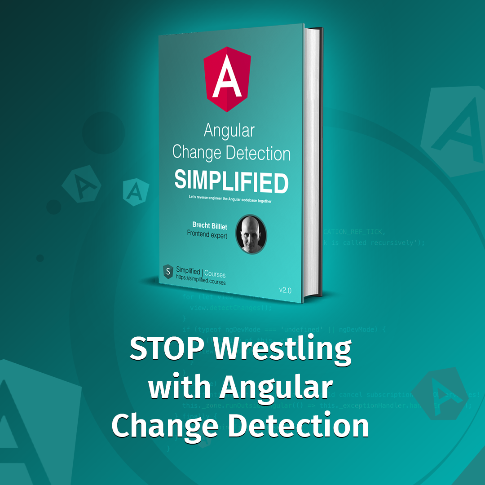

Should we use OnPush in Angular or not? That's the million-dollar question.
Will it increase performance significantly? Will OnPush make our application better, more performant, and more predictable?
We will dive deep into this topic in this article.

## Not using OnPush

First of all, let's start with not using the `OnPush()` Change Detection strategy of Angular.
When we don't use the `OnPush()` Change Detection strategy of Angular we will default to `ChangeDetectionStrategy.Default`.

```typescript
import { ChangeDetectionStrategy } from '@angular/core';

@Component({
    ...
    // This can be omitted, since it is the default
    changeDetection: ChangeDetectionStrategy.Default
})
```

A component has a `lView` (logical view) behind the scenes and that is the thing Change Detection runs on.
When we use the default Change Detection Strategy, every view will get change detected on every `tick()` in Angular.
This means that whenever something happens, for instance:
- The initial render starts
- A bound event is triggered
- A `setInterval()` is being executed, an `AddEventHandler()` statement is being executed
- Any other native asynchronous browser event is being captured by `zone.js`

...

That Change Detection will run on all views that are bound to components that should be rendered in the DOM of our application.
This is suboptimal, to say the least. **We don't want to trigger Change Detection on all of our views every time**.

This could result in bad performance, especially when we have multiple `*ngFor` directives that are creating tons and tons of instances of components.

## Introducing OnPush

```typescript
import { ChangeDetectionStrategy } from '@angular/core';

@Component({
    ...
    changeDetection: ChangeDetectionStrategy.OnPush
})
```

In short: `ChangeDetectionStrategy.OnPush` is telling Angular to **never** run Change Detection on a `lView`, unless:
- It runs for the first time
- It is marked `lViewFlags.dirty`

When the view is marked `lViewFlags.dirty` it will perform Change Detection when the component needs to be rendered. Otherwise, it will not (unless on initial render).
Now when is a `lView` marked `lViewFlags.dirty`? 
- When a bound event (`@Output()`) is triggered from within that view.
- When the view uses an `async` pipe.
- When a bound event is triggered from a child component of that view.
- When a manual `markForCheck()` is run on the view or one of the child views of that view.
- When a set input is called on that view by a parent when Change Detection runs.

So when the view:
- Has a user clicking on a button
- Has a user doing anything that will trigger some kind of event
- Has an async pipe
The `lView` that is bound to that component and all its parent's views are marked as `lViewFlags.dirty`, so that component and all its parents (including the root component)
will be Change Detected.

So whether the root component has the `OnPush` strategy applied or not, it will get Change Detected anyway, since it will be marked as `lViewFlags.dirty`,  by one of its child components.

You can play around with [this example](https://stackblitz.com/edit/angular-ivy-mmdsty?file=src%2Fapp%2Fapp.component.ts){:target="_blank"}.

Click on the mark buttons to see how the `OnPush` strategy behaves.

## How big is the impact of ChangeDetection.OnPush in Angular?

The impact of `OnPush` should be considered big, especially when there are a lot of components that need to be rendered.
We can decrease the number of components that should be rendered significantly, by using the `OnPush` strategy.

We recommend putting `OnPush` on all components unless:
- They have inputs that are not immutable (Eg `FormControl`, `FormGroup`), `OnPush` only works with immutable inputs.
- They are **smart** top-level components that do asynchronous tasks like fetching data.

This simple example will break Change Detection for instance:

```typescript
@Component({
    selector: 'my-app',
    template: `{{luke|json}}`,
    imports: [CommonModule],
    styleUrls: [ './app.component.css' ],
    standalone: true,
    changeDetection: ChangeDetectionStrategy.OnPush
})
export class AppComponent implements OnInit {
    private readonly httpClient = inject(HttpClient);
    luke: any;

    public ngOnInit(): void {
        this.httpClient.get('https://swapi.dev/api/people/2').subscribe((luke) => {
            // will be set after Change Detection run
            // will not be shown because this component is not
            // lViewFlags.dirty
            this.luke = luke
        });
    }
}
```

[Here is the Stackblitz example](https://stackblitz.com/edit/angular-ivy-x6vgcn?file=src%2Fapp%2Fapp.component.ts,src%2Fmain.ts){:target="_blank"}

If we comment out the `changeDetection: ChangeDetectionStrategy.OnPush` line it will default to the default Change Detection strategy and the data will be rendered.

**Remember:** If any of the children of this top-level `AppComponent` triggers an event, (basically whenever something happens in the entire application structure) it will be marked as `lViewFlags.dirty` anyway, resulting in Change Detection being run for this component. Unless there is an asynchronous task going on like a pending XHR call. Well, in that case, we want Change Detection to work, right?! If we would use `OnPush` on that component it would **break**.

We could use the `async` pipe that will mark the view and all its parents `lViewFlags.dirty`, but that doesn't make sense for `PUT`, `POST`, `PATCH` or `DELETE` calls.

```typescript
import { ChangeDetectionStrategy } from '@angular/core';

@Component({
    ...
    changeDetection: ChangeDetectionStrategy.OnPush,
    template: `
    <!-- This makes no sense -->
    <!-- Triggering a DELETE request from a template is -->
    <!-- not something we want to do -->
    {{deleteResult$|async}}
`
})
export class AppComponent{
    ...
    // We don't want to trigger this from the template
    public readonly deleteResult$ = this.httpClient.delete(...)
}
```

We do recommend using the `async` pipe instead of manually subscribing, but in some cases, it's not possible or becomes complex.
That's why we recommend not using the `OnPush` strategy on those kind of components unless you know what you are doing. It will not be any more performant since the component will be marked `lViewFlags.dirty` unless when an XHR call resolves. That's when we do want Change Detection to work.
Avoid manual `markForCheck()` statements or even `setTimeout()` statements as much as possible.

## So should we use OnPush on all components?

We could, but only if we really grasp Change Detection and we know what we are doing, otherwise it can result in unexpected behavior and bugs.
If you want to completely master Angular Change Detection you could check out [this Angular Change Detection book](https://www.simplified.courses/angular-change-detection-simplified-e-book){:target="_blank"} we wrote.

## ngZone.runOutsideAngular() can have a bigger performance impact

While using the `OnPush` strategy certainly helps, it's a good idea to limit the amount of `tick()` functions being called.
In some cases running Change Detection on the top level (`tick()`), is a lot more expensive than actually running Change Detection on a component.
Take this example for instance:

```typescript
@Component({
    ...
    changeDetection: ChangeDetectionStrategy.OnPush,
})
export class ChildComponent{
    constructor() {
        setInterval(() => {
            // triggers tick
        }, 1000);
    }
}
```

While this `setInterval()` code doesn't do anything, it will still trigger Change Detection every second, even with the `OnPush` strategy applied to it.

[Checkout this example](https://stackblitz.com/edit/angular-ivy-ha2wmm?file=src%2Fapp%2Fapp.component.ts){:target="_blank"}

What if we would have a `mouseMove` event (Eg. for a drag-and-drop) that fires dozens of times a second, while the user is dragging...
This would result in Change Detection being run on the top-level multiple times a second.
A great way to optimize this is the use of `ngZone.runOutsideAngular` which we cover in [this article where we will create an Angular drag-and-drop with RxJS](https://blog.simplified.courses/angular-performant-drag-and-drop-with-rxjs/){:target="_blank"}.

## Conclusion

Use Angular its `OnPush` strategy but only use it if you grasp Angular Change Detection. If you want to learn more about this subject. You could support me by buying this book.
[](https://www.simplified.courses/angular-change-detection-simplified-e-book){:target="_blank"}

I hope you like the article. I'm looking forward to reading your comment in the comments below!

Special thanks to the reviewer [Bryan Hannes](https://bryanhannes.com/){:target="_blank"}.

If you liked the article, please leave a comment!

If you like to learn directly from me, check out my [Angular Training](https://www.simplified.courses/angular-training){:target="_blank"} and [Angular Coaching](https://www.simplified.courses/angular-coaching){:target="_blank"}