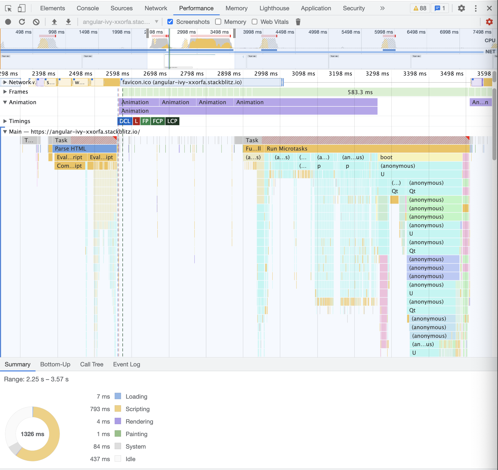

This article is about reverse-engineering an open-source framework like Angular.
When I wrote [Angular Change Detection book](https://www.simplified.courses/angular-change-detection-simplified-e-book) I had to reverse-engineer the Angular code-base to understand what was going on behind the scenes. Change Detection is a complex thing and the documentation on that topic is quite limited at the time of writing this. To understand code better, **reverse-engineering can be very liberating**:
- It helps us reason like the developer who wrote the code that we are reverse engineering.
- It gives us valuable insights.
- Most of the time it brings more value than the actual documentation.
- It takes us out of our comfort zone.
- We will remember it longer than reading docs because it takes more effort.
- We can click through the code and connect the dots ourselves.
- It's fun!

Reverse-engineering source code can be done in different ways and sometimes this can be a tricky task. Comprehending the code of someone else can be very hard, especially when there is something like `Zone.js` that makes it all a tad more complex. The first thing that I would normally advise to do, is to clone the [GitHub repo](https://github.com/angular/angular), run an `npm install` and traverse the codebase and click through as much as possible.

Today we are going to explore another solution that I call **Flame Chart reversing**. In short: we will use the Chrome Developer tools **performance tab** to see what's going on behind the scenes and start reverse-engineering from there.

One thing to note is that the source maps of Angular don't add up completely, so we will need a combination of the Angular codebase and the Chrome Developer tools to make sense of what happens behind the scenes.
Buckle up! We are going deep!

## Stackblitz example

We will use this [Stackblitz example](https://stackblitz.com/edit/angular-ivy-xxorfa) to reverse-engineer some angular code.
We will reverse-engineer the bootstrapping process of our application. We want to have a clear overview of what happens when we call the `bootstrapAppliction()` in the `main.ts` of our Stackblitz example.

## bootstrapApplication()

In `main.ts` we bootstrap our application with the `bootstrapApplication()` function. This function takes a standalone component and creates an application for that component.
Let's find out what happens behind the scenes when that function is being executed.
For that, we will use the Performance tooling of Chrome Developer tools.

First of all, let's open the Stackblitz example in an incognito window. In that case, there is no noise from any Chrome extensions that we might have installed.
In Stackblitz we can click the **Open in new Tab** button so that the application runs in another tab (we don't want to measure Stackblitz). In that screen, we will open the Chrome Devtools by clicking **View > Developer > Developer tools**. Now let's go to the **Performance** tab.
To continue, we will not use the **record** button but the **Start profiling and reload page** button. This is the second button from the left on the following image:


When we click this button it will reload the page and start profiling until the application is stable. This will have created a screen that looks like this:


In the first row, we see something that looks like mountains that show us the profiling of the CPU.
This row has 2 vertical handles that we can use to select a time range inside this row. Let's make these as wide as possible, to begin with.
We will use the search function (`Cmd + f` on OSX) and type `bootstrapAppliction` and press the **enter** key.

Now we have to look for a red border in the flame chart. This is the `bootstrapApplication()` function that has been located and highlighted for us.


When we zoom in on the `bootstrapApplication()` function we can see that it delegates to the `internalCreateApplication()` function. 
This function does 2 things apparently:
- `createOrReusePlatformInjector`
- `run()`


We want to know what's going on in the `internalCreateApplication()` function so we can click it, and in the **Summary** tab, we see that this function lives in the `application_ref.ts`. It tells us it lives on line 346 but in reality, it lives on line 190.
Why the source maps are messed up is unknown to us but we will need both the **Performance** tab and the actual codebase of Angular.


Since the source maps aren't working completely let's look for the function `internalCreateApplication()` in `packages/core/src/application_ref.ts` in our locally checked-out Angular repo. If you haven't cloned the codebase yet, do it now and run an `npm i` while you are at it.

When we look at `internalCreateApplication()` in `packages/core/src/application_ref.ts`, we can already retrieve a ton of information from the inline documentation:
**Internal create application API that implements the core application creation logic and optional bootstrap logic.**
@returns A promise that returns an `ApplicationRef` instance once resolved.


For this article, we want to reverse engineer how `@Output()` in Angular works.
An Angular `@Output()` is a decorator that is initialized with some kind of observable and that can be used by a child component to notify its parent of some kind of event.
We initialize an `@Output()` like this:

```typescript
@Output() do = new EventEmitter();
```

By default, we will use an `EventEmitter` but we could use any kind of observable if we want to.
Consuming this `@Output()` can be done by the following syntax:

```html
<hello (do)="onDo()"></hello>
```

This `HelloComponent` will have an `@Output()` called `do` and we use the parenthesis syntax to bind it to an `onDo()` function.

## Let's reverse engineer an Angular Output

What we want to demystify is what will happen behind the scenes when an `@Output()` emits. 
Let's create a Stackblitz example that does just that **and only that!**
We have an `AppComponent` that holds an `HelloComponent` that has a `do()` `@Output()`:

```typescript
// HelloComponent
@Component({
    selector: 'hello',
    standalone: true,
    template: `<button (click)="do.emit('hi')">Trigger output</button>`,
})
export class HelloComponent  {
    @Output() do = new EventEmitter<string>();
}

// AppComponent
@Component({
    selector: 'my-app',
    standalone: true,
    imports: [HelloComponent],
    template: `
        <hello (do)="onDo()"></hello>
    `,
})
export class AppComponent {
    public onDo(): void {
        console.log('do');
    }
}
```

In the `onDo()` function which is bound to that `@output()` we will log the string `do`. That's it, you can check the example [here](https://stackblitz.com/edit/angular-ivy-xxorfa).
We would advise opening the link in **incognito mode** since there are no extensions there that would tamper with the process.

Since we want to know what happens when an `@Output()` is triggered, let's click the **Trigger output** button and click the recording button again.

What we need to do now is search for a bump or small mountain in the CPU screen and 
select that time so we can have a closer look!


At the end of this view, we see a long vertical line. This is the information that we need.