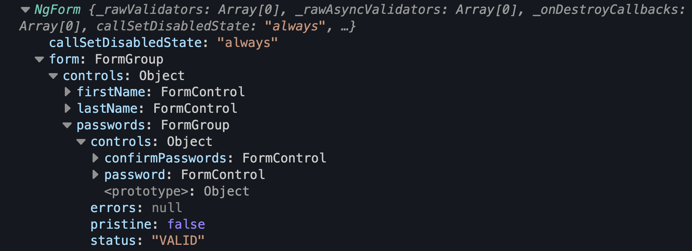

## Introduction

**Update. I have [open-sourced this solution](https://blog.simplified.courses/i-opensourced-my-angular-template-driven-forms-solution/){:target="_blank"}
Where I showcase Template-driven Forms with:**
- A unidirectional dataflow
- Typ(o) safety
- Vest validation suites
- Async validators
- Declarative and reactive ViewModels
- **Without any boilerplate at all!**

When Angular was released in 2016, the only solution they had for creating forms was template-driven forms. A principle where directives in the template were used to create forms. In Angular 4 the core team introduced a new concept called **reactive forms**.
It was a new way with a reactive API that exposed RxJS Observables when we wanted them. Pretty soon everyone was agreeing that reactive forms were the new way to go. The new best practice. Template-driven forms were even frowned upon and I have been advising companies to use Reactive forms for years. In Reactive forms, we would use `FormBuilder` to create `FormGroup` instances with `FormControl` and `FormArray` instances.
An argument that keeps coming back supporting Reactive Forms is that **they were better testable**. We are not sure how valid that point is since we see it as a best practice to test our components including our templates.
Another argument was **type-safety**. Even though reactive forms weren't type-safe for a lot of years. They are now, and template-driven forms are not.
Here are 3 other reasons why some developers favor reactive forms over template-driven forms:
- Manual event binding on inputs can introduce a lot of work. They rather subscribe to the `valueChanges` observable of a `FormControl` or `FormGroup` if they want to listen to those kinds of changes.
- Validations are shattered across the entire template making it a lot of work and less dynamic.
- They can leverage RxJS a lot more by combining observables, using `debounceTime()`, `switchMap()`, etc...

When watching 2 talks from [Ward Bell](https://twitter.com/wardbell){:target="_blank"} at ngConf and reading articles from [Tim De Schryver](https://timdeschryver.dev/blog/a-practical-guide-to-angular-template-driven-forms){:target="_blank"} and talking with [Jeffrey Bosch](https://twitter.com/jefiozie){:target="_blank"}, I started to realize that I had to take a closer look at template-driven forms and re-evaluate how I deal with forms today.

After doing tons and tons of research, and deciding to update some major applications to template-driven forms for a big client of mine, I have to admit that switching back to template-driven forms made forms fun again.

The goal of this article is to show why template-driven forms can make your life as an Angular developer easier and how easy it is to make them **reactive after all**.
This article will have more follow-up articles where we will tackle specific implementations in depth: Like validations etc.
We will focus on how to **make template-driven forms reactive** and how we can enjoy the best parts of both worlds.

## Let Angular work for you

Did you know that template-driven forms create `FormGroup` instances and `FormControl` instances for us behind the scenes?
Well they do, and Ward Bell calls it: **"Let angular do the work for you"**. The truth is: when writing template-driven forms we have to write a lot less code. We don't have to worry about manually creating our `FormGroup` and `FormControl` instances. Angular does that automatically for us.

Take this reactive forms component for instance:

```typescript
@Component({
  selector: 'my-app',
  standalone: true,
  imports: [CommonModule, ReactiveFormsModule],
  template: `
  <form [formGroup]="form" (ngSubmit)="submit(form.value)">
      <label>
        First name
        <input type="text" [formControl]="form.controls.firstName"/>
      </label>
      <label>
        Last name
        <input type="text" [formControl]="form.controls.lastName"/>
      </label>
      <h2>Password</h2>
      <label>
        Password
        <input
          type="password"
          [formControl]="form.controls.passwords.controls.password"/>
      </label>
      <label>
        Confirm password
        <input
            [formControl]="form.controls.passwords.controls.confirmPassword"
            type="password"
        />
      </label>
      <button>Submit form</button>
  </form>
  `,
})
export class App {
  private readonly formBuilder = inject(FormBuilder);
  public readonly form = this.formBuilder.group({
    firstName: [''],
    lastName: [''],
    passwords:  this.formBuilder.group({
      password: [''],
      confirmPassword: [''],
    }),
  });

  public submit(): void {}
}
```

We have a fairly clean template, and we had to create some sort of composition with the `FormBuilder` to create the Reactive form. We can add validations as the second value in the arrays and we can extract observables from our form.
Now look at the template-driven variant of this form:

```typescript
class User {
  public firstName = '';
  public lastName = '';
  public passwords = {
    password: '',
    confirmPassword: ''
  };
}
@Component({
  selector: 'my-app',
  standalone: true,
  imports: [CommonModule, FormsModule],
  template: `
  <form #form="ngForm" (ngSubmit)="submit(form.value)">
      <label>
        First name
        <input type="text" [(ngModel)]="model.firstName" name="firstName"/>
      </label>
      <label>
        Last name
        <input type="text" [(ngModel)]="model.lastName" name="lastName"/>
      </label>
      <h2>Password</h2>
      <div ngModelGroup="passwords">
        <label>
          Password
          <input
            type="password"
            [(ngModel)]="model.passwords.password" name="password"/>
        </label>
        <label>
          Confirm password
          <input
            [(ngModel)]="model.passwords.confirmPassword" name="confirmPasswords"
            type="password"
          />
        </label>
      </div>
      <button>Submit form</button>
  </form>
  `,
})
export class App {
  public model = new User();
  public submit(value: any): void {
    console.log(value);
  }
}
```

We have created a clean `User` class that is completely type-safe and even has initial values. The typescript part of `App` has been simplified drastically. 
In the form element, we see that we have added the `#form="ngForm"` syntax to get access to the `ngForm` directive.
For the rest, we use a combination of `ngModel`, `name` and `ngModelGroup` to create our form.
The syntax of this form is quite simple and because we use the correct values in the `name` and `ngModelGroup` Angular has created the perfect reactive form for us behind the scenes, automatically!

## Getting access to the reactive form

Template-driven forms do all the work for us, but what good are they if we can't access the reactive form. We want to be able to get observables from it right? It turns out this is quite easy:

```typescript
@Component({
  ...
  template: `
  <form #form="ngForm" (ngSubmit)="submit()">
      ...
  </form>
  `,
})
export class App {
  @ViewChild('form') form!: NgForm;
  ...

  public submit(): void {
    console.log(this.form);
  }
}
```

We are using the `@ViewChild()` decorator to get access to the form, and we log it to the console in the `submit()` method.
Let's check out what this logs:



This looks exactly like what `FormBuilder` would have made for us, but Angular did all the work for us!

## But what about validations?

Validations are a pain, and we definitely don't want to create custom validators and directives for them and add them everywhere in our templates. That is true, but I also don't like to see them in our reactive forms.
In [this talk](https://www.youtube.com/watch?v=EMUAtQlh9Ko){:target="_blank"} from Ward Bell, Ward explains that we shouldn't think about validation as form-validations but rather model-validations. We want to reuse these validations in different places and we want to validate a model in one place.
We don't want to go looking through our template-driven or reactive forms where all these validations lie.

Removing validations from the forms and putting them in models brings us some advantages:
- They are easy to find in one place
- They are reusable on other places of the app and even on a node.js backend
- They are composable and functional
- They are very easy to test
- They avoid boilerplate
- We can just glue them to our `FormControl`'s and `FormGroup`'s automatically

Since we want to keep this article to the point, we will tackle validations and remove validation-message-boilerplate in a next article. If you can't wait, drop me a DM and I will share some stackblitz code with you.
So for now, let's don't talk about validations anymore, but we promise we will tackle it in one of our next articles in depth.

## Making it reactive

Making it reactive, however, is an important part of this article. What we want but currently don't have is:
- Type safety on `form`
- Getting observables from our form
- Getting observables from groups or controls of our form
- We don't want to have to bind all the events manually in the template. We want to work against one reactive form (which was the whole point of Reactive forms)

The first thing we need to do is create a `FormModel` type so it can take partial updates:

```typescript
type FormModel = Partial<{
    firstName: string;
    lastName: string;
    passwords: Partial<{
        password: string;
        confirmPassword: string;
    }>;
}>;

```
Now we need to add a `formValue` signal that holds the form state,
make the `App` implement the `ngAfterViewinit()` lifecycle hook and feed our `formValue` signal with that.

```typescript
@Component({
  ...
  template: `
  <form #form="ngForm" (ngSubmit)="submit()">
  ...
  `,
})
xport class App implements AfterViewInit  {
    @ViewChild('form') form!: NgForm;

    // Signal that holds our state
    protected readonly formValue = signal<FormModel>({});

    public ngAfterViewInit(): void {
        this.form?.valueChanges?.subscribe((v) => {
            this.formValue.set(v);
        });
    }
    
    public submit(): void {
        console.log(this.form);
    }
}

```

Now we can create a [ViewModel](https://blog.simplified.courses/reactive-viewmodels-for-ui-components-in-angular/){:target="_blank"} for that and even drop the banana in the box syntax and work with one-way-databinding since the `valueChanges` of the (by angular) generated `form` feeds our `formValue` signal.

```typescript
@Component({
  ...
  template: `
  <form #form="ngForm" (ngSubmit)="submit()">
      <label>
        First name
        <input type="text" [ngModel]="vm.user.firstName" name="firstName"/>
      </label>
      ...
      <button>Submit form</button>
  </form>
  `,
})
export class App implements AfterViewInit {
    ...
    protected readonly formValue = signal<FormModel>({});
    
    // Calculate the ViewModel
    private readonly viewModel = computed(() => {
        return {
            user: this.formValue()
        };
    });

    // Expose the ViewModel as a getter
    protected get vm() {
        return this.viewModel();
    }
  ...
}
```

### But what about all the other goodies reactive forms have to offer us?

You are talking about the status, right?! Whether controls are `valid`, `dirty`, etc...
If you care about these states, then we can just add them to the state and create signals for them:

```typescript
@Component({...})
// Update the type so it also supports dirty and valid
export class App implements AfterViewInit  {
    ...
    protected readonly formValue = signal<FormModel>({});
    protected readonly formDirty = signal<boolean>(false);
    protected readonly formValid = signal<boolean>(false);

    public ngAfterViewInit(): void {
        this.form?.valueChanges?.subscribe((v) => {
            this.formValue.set(v);
            this.formDirty.set(this.form.form.dirty);
            this.formValid.set(this.form.form.valid);
        });
    }
    ...
}
```

We can easily consume the new state through our ViewModel:

```typescript
@Component({
  ...
  template: `
  <form #form="ngForm" (ngSubmit)="submit()">
      Dirty: {{vm.dirty}}
      Valid: {{vm.valid}}
      ...
      <button>Submit form</button>
  </form>
  `,
})
// Update the type so it also supports dirty and valid
export class App implements AfterViewInit {
    ...

    protected readonly formValue = signal<FormModel>({});
    protected readonly formDirty = signal<boolean>(false);
    protected readonly formValid = signal<boolean>(false);
    private readonly viewModel = computed(() => {
        return {
            user: this.formValue(),
            dirty: this.formDirty(),
            valid: this.formValid(),
            confirmPasswordDisabled: !this.formValue().passwords?.password,
            showPasswords: this.formValue().firstName,
        };
    });
}
```

### Enabling and disabling controls

Do you remember how annoying it was to enable and disable controls based on how other controls changed in Reactive forms?
**This becomes complex really fast!**:

```typescript
ngOnInit(): void {
  this.form.controls.passwords.password.valueChanges
    .pipe(
      takeUntil(this.destroy$$)
    )
    .subscribe(value => {
      if(value === ''){
        this.form.controls.passwords.confirmPassword.disable():
      } else{
        this.form.controls.passwords.confirmPassword.disable():
      }
    })
}

```
This isn't declarative at all and the bigger our component gets, the harder it would become to maintain.
It's nice to use the declarative approach and just calculate it in the ViewModel.

Now you can do most of that logic in a declarative way in the ViewModel. Look how clean this got!

```typescript
@Component({
  ...
  template: `
  <form #form="ngForm" (ngSubmit)="submit()">
      ...
      <input [disabled]="vm.confirmPasswordDisabled" .../>
       ...
  </form>
  `,
})
export class App implements AfterViewInit {
  ...
    private readonly viewModel = computed(() => {
        return {
            user: this.formValue(),
            dirty: this.formDirty(),
            valid: this.formValid(),
            confirmPasswordDisabled: !this.formValue().passwords?.password,
            showPasswords: this.formValue().firstName,
        };
    });
  ...
}
```

We could take it even further and remove the passwords when there is no first name filled in. We could use an `*ngIf` directive for that and YES! Angular will automatically remove and recreate a `FormGroup` with 2 `FormControls` for us. The only thing that we need to do is add a `showPasswords` property in our ViewModel and calculate it there:

```typescript
@Component({
  ...
  template: `
  <form #form="ngForm" (ngSubmit)="submit()">
      ...
      <div ngModelGroup="passwords" *ngIf="vm.showPasswords">
        ...
      </div>
      ...
  </form>
  `,
})
export class App  implements AfterViewInit {
  ...
    private readonly viewModel = computed(() => {
        return {
            user: this.formValue(),
            dirty: this.formDirty(),
            valid: this.formValid(),
            confirmPasswordDisabled: !this.formValue().passwords?.password,
            showPasswords: this.formValue().firstName,
        };
    });
  ...
}
```

Try doing that with a reactive form and keep it simple at the same time. By using this approach we let Angular work for us and we still benefit from completely type-safe reactivity, but without all the boilerplate code and complexity...

## Specific reactivity

We can use effects, RxJS interop and a bunch of other logic.
Take this Stackblitz example as the most complete demo of template-driven forms!


## Summary

Reactive forms have benefits, and so have template-driven forms. But template-driven forms create reactive forms behind the scenes.
Angular does that automatically for us. Using template-driven forms with signals will give your form steroids and will get the best from both worlds:
- Remove boilerplate
- Clean templates: no `(change)` expressions shattered in the template.
- Turn forms into easy-to-read declarative code
- Create a form based on a simple class with initial values

Also, check out these 2 talks from ward bell:
- [Prefer Template-Driven Forms](https://www.youtube.com/watch?v=L7rGogdfe2Q&t=3s){:target="_blank"}
- [Form Validation Done Right ](https://www.youtube.com/watch?v=EMUAtQlh9Ko){:target="_blank"}

Interested in playing with a complex form? Check out [my open sourced Template-driven forms solution](https://blog.simplified.courses/i-opensourced-my-angular-template-driven-forms-solution/){:target="_blank"}!

Thanks to the awesome reviewers;
- [Daniel Glejzner](https://twitter.com/danielglejzner){:target="_blank"}
- [Jeffrey Bosch](https://twitter.com/jefiozie){:target="_blank"}

If you like to learn directly from me, check out my [Angular Training](https://www.simplified.courses/angular-training){:target="_blank"} and [Angular Coaching](https://www.simplified.courses/angular-coaching){:target="_blank"}
