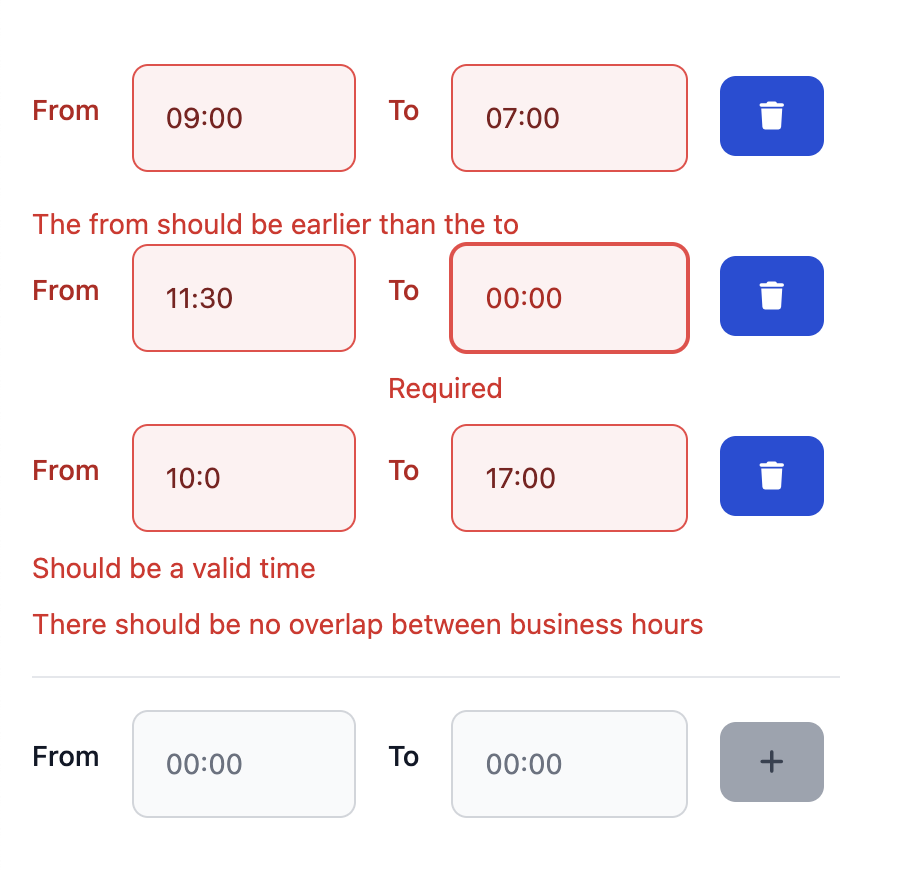
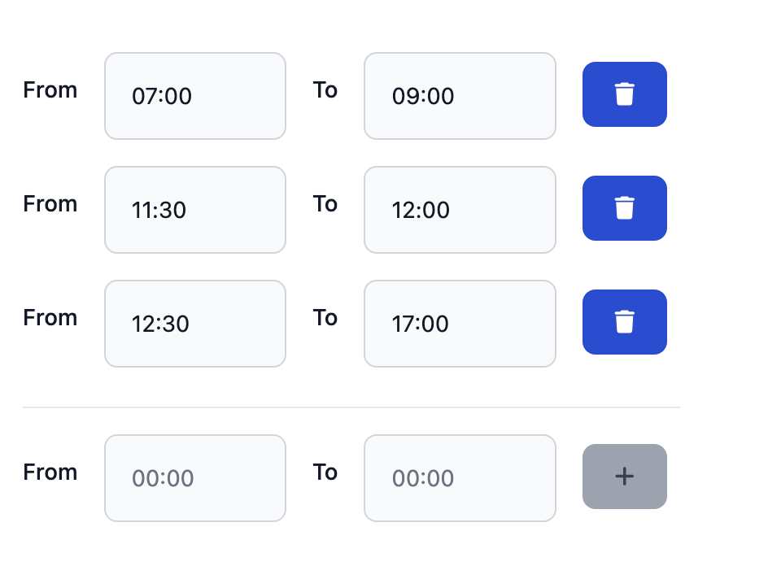

## Introduction

**ngx-vest-forms** is based on template-driven forms.
It's actually a tiny adapter between [Angular](https://angular.dev){:target="_blank"} and [Vest.js](https://vestjs.dev/){:target="_blank"}
Since I released **ngx-vest-forms**, I get the following question a lot.
**"Are you able to do form-arrays with template-driven forms?"**

**"Well the `FormArray` type, does not exist in template-driven forms, but sure
we can do that"**

**"Okay then Brecht, tell me this, how would apply validators on there?"** 
You know what? Let's build this thing together! This is an in-depth tutorial on how to create a form with a form-array
containing business hours and complex validations.

Since this is a more complex tutorial, if you don't know how form-arrays in template-driven-forms in Angular work. Please read this article first:
[Template driven form-arrays](https://blog.simplified.courses/template-driven-forms-with-form-arrays/){:target="_blank"}.
It explains the use of the `keyvalue` pipe, and how we treat the array as an object of indexes.

### What are we building?

We are building a form to manage business hours.
Every business hour exists out of a `from` and a `to` property.
We want to:
- add business hours
- update business hours
- delete business hours

Since we want to dive deep into the validation stuff let's set up some validation requirements:
- There should always be at least one business hour filled in
- The `from` and the `to` inputs are both required
- The `from` and the `to` should be valid times (`00:00` format)
- The `to` input should contain a later time than the `from` input
- This should be shown in the form of validation errors, both on the add business hour and update business hour
- Business hours should not overlap, otherwise also show a validation message
- We want the validation messages to be set up in a reusable, composable way
- We want to use these validations on the backend as well (this tutorial doesn't have a backend part)

These are 2 screenshots of an invalid and a valid state:

<div style="display:flex; max-width: auto;">
    
    
</div>

The one on the left looks fugly, but that's because I wanted to showcase all the validation messages
in one screen.

### Creating a brand new Angular app

#### Prerequisites
Ensure you have Angular CLI installed. If not, install it using:

```shell
npm install -g @angular/cli
```

Make sure that you are at least on Angular 18, this tutorial does not work
for versions below that:

```shell
ng --version
```

Open your terminal and run:

```shell
ng new ngx-vest-forms-demo
cd ngx-vest-forms-demo
```

Choose the following options:

```chatinput
? Which stylesheet format would you like to use? Sass (SCSS)     [ 
https://sass-lang.com/documentation/syntax#scss                ]
? Do you want to enable Server-Side Rendering (SSR) and Static Site Generation 
(SSG/Prerendering)? No
```

#### Generate the components

We need one smart component called `business-hours-form` and 2 ui components:
`business-hours` and `business-hour`.
Generate them with the following commands:

```shell
ng generate component components/smart/business-hours-form --type=smart-component
ng generate component components/ui/business-hours --type=ui-component
ng generate component components/ui/business-hour --type=ui-component

```

#### Installing dependencies

To achieve this complexity in forms, we have to install **vest** and **ngx-vest-forms**.
Run the following command:

```shell
npm install vest ngx-vest-forms
```

#### Creating the form models

Create a `models` directory in the `src/app` directory and add a file named `business-hours-form.model.ts` with the following content:

```typescript
// src/app/models/business-hours-form.model.ts

import { DeepPartial } from 'ngx-vest-forms';

export type BusinessHoursFormModel = DeepPartial<{
  businessHours: {
    addValue: BusinessHourFormModel;
    values: { [key: string]: BusinessHourFormModel };
  }
}>;

export type BusinessHourFormModel = DeepPartial<{
  from: string;
  to: string;
}>;
```

`businnesHours` will refer to a form group called `businessHours`.
`addValue` will refer to a form group called `addValue` and
`values` will refer to a form group called `values`.
Both of these form groups have two form controls named `from` and `to`

Type-safety is important so create these 2 shapes in `business-hours-form.model.ts`:

```typescript
// src/app/models/business-hours-form.model.ts
...

export const businesssHourFormShape: DeepRequired<BusinessHourFormModel> = {
  from: '00:00',
  to: '00:00'
};

export const businessHoursFormShape: DeepRequired<BusinessHoursFormModel> = {
  businessHours: {
    addValue: { ...businesssHourFormShape },
    values: {
      '0': { ...businesssHourFormShape }
    }
  }
};
```

If you don't know why we are adding these shapes, [read this first](https://blog.simplified.courses/making-angular-template-driven-forms-typesafe/){:target="_blank"}

### Setting up vest

We are letting **Vest.js** handle our validations, so let's set up a vest suite in
`src/app/validations/business-hours.validations.ts`:

```typescript
import { only, staticSuite, test } from 'vest';
import { BusinessHoursFormModel } from '../models/business-hours-form.model';
export const businessHoursSuite = staticSuite((model: BusinessHoursFormModel, field?: string) => {
    if (field) {
        only(field);
    }
});
```

This is the most simple suite we can build, and this doesn't do anything just yet.
Let's first set up our form:

In `src/app/components/smart/business-hours-form.smart-component.ts`, let's update the component like this:

```typescript
import { Component, signal } from '@angular/core';
import { JsonPipe } from '@angular/common';
import { ROOT_FORM, ValidateRootFormDirective, vestForms } from 'ngx-vest-forms';
import { BusinessHoursFormModel, businessHoursFormShape } from '../../../models/business-hours-form.model';
import { businessHoursSuite } from '../../../validations/business-hours.validations';
import { BusinessHourUiComponent } from '../../ui/business-hour/business-hour.ui-component';

@Component({
    selector: 'app-business-hours-form',
    standalone: true,
    imports: [
        JsonPipe, // to visualize the errors and form value
        vestForms, // this contains the scVestForm directive and all the rest we need to set up forms
        // We need this to do validations on the root form (at least one business hour remember)
        ValidateRootFormDirective,
        // We need to import the ui components
        BusinessHourUiComponent,
        BusinessHoursUIComponent,
    ],
    templateUrl: './business-hours-form.component.html',
    styleUrls: ['./business-hours-form.component.scss'],
})
export class BusinessHoursFormSmartComponent {
    // Keep the formValue in a signal
    protected readonly formValue = signal<BusinessHoursFormModel>({});
    // Keep the form valid state in a signal
    protected readonly formValid = signal<boolean>(false);
    // Keep the errors of the form in a signal
    protected readonly errors = signal<Record<string, string>>({});
    // Expose the vest validation suite to the template
    protected readonly suite = businessHoursSuite;
    // Expose the shape to the template
    protected readonly shape = businessHoursFormShape;
    // We just need access to this const
    protected readonly ROOT_FORM = ROOT_FORM;
}
```

Great! Let's dive into the HTML: 
- First apply the **scVestForm** directive, enriching the form element with outputs and the ability to
  store the `formValue`, `formShape` and `suite`.
- Pass the `formValue`, `formShape` and `suite`.
- Feed the `formValid`, `errors` and `formValue` signals with the right values.
- Add a span there that listens to the `errors` signal and extracts the `ROOT_FORM` validations,
  (This will be used to show that at least one business hour should be added)
- Lastly let's add the business-hours component and pass it the `businessHours` model from the `formValue` signal.

```html
<form
        scVestForm
        [validateRootForm]="true"
        [formValue]="formValue()"
        [formShape]="shape"
        [suite]="suite"
        (validChange)="formValid.set($event)"
        (errorsChange)="errors.set($event)"
        (formValueChange)="formValue.set($event)"
>
    <span>{{errors()?.[ROOT_FORM]}}</span>
    <app-business-hours [businessHoursModel]="formValue().businessHours"></app-business-hours>
</form>
<br/>

<!--
I like to add these to see how the form becomes valid/invalid and see which errors live on the form.
-->
<p>Valid: {{ formValid() }}</p>
<h3>The value of the form</h3>
<pre id="json-data">
   {{ formValue() | json }}
</pre>
<pre id="json-errors">
  {{ errors() | json }}
</pre>

```

### Wrapping the business-hour component

In `src/app/components/ui/business-hour/business-hour.ui-component.ts`, add import `vestForms`:
This assures that the `ngModel` and `ngModelGroup` selectors create validators behind the scenes, it also exposes the `sc-control-wrapper` component.

It is import to set the `viewProviders` to the `vestFormViewProviders`, other-wise angular won't
have any notion of `NgForm`.

The next thing we need to do is create an input for the businessHour.
Make sure that it is nullable, since template-driven forms are always deep partial:

```typescript
import { Component, Input } from '@angular/core';
import { vestForms, vestFormsViewProviders, } from 'ngx-vest-forms';
import { BusinessHourFormModel } from '../../../models/business-hours-form.model';

@Component({
  selector: 'app-business-hour',
  standalone: true,
  imports: [vestForms],
  templateUrl: './business-hour.ui-component.html',
  styleUrls: ['./business-hour.ui-component.scss'],
  viewProviders: [vestFormsViewProviders],
})
export class BusinessHourUiComponent {
  @Input() public businessHour?: BusinessHourFormModel = {}
}

```

Let's set up the HTML of this component in `src/app/components/ui/business-hour/business-hour.ui-component.html`:
We will apply the `sc-control-wrapper` to the 2 divs containing the inputs, because both the `from` and the `to`,
should show errors if they are invalid.
Every input has a `[ngModel]` (one-way-databinding) and a `name` attribute.
Wire it correctly according to the snippet below

```html
<div sc-control-wrapper>
  <label>
    <span>From</span>
    <input
            type="text"
            [ngModel]="businessHour?.from"
            name="from"
    />
  </label>
</div>
<div sc-control-wrapper>
  <label>
    <span>To</span>
    <input type="text"
            [ngModel]="businessHour?.to"
            name="to"
    />
  </label>
</div>
```

### Wiring further

In `src/app/app.component.html`, remove the contents and replace them with our smart component:

```html
<app-business-hours-form></app-business-hours-form>
```

In `src/app/app.component.html`, remove the contents and replace them with this:

```typescript
import { Component } from '@angular/core';
import {
  BusinessHoursFormSmartComponent
} from './components/smart/business-hours-form/business-hours-form.smart-component';

@Component({
  selector: 'app-root',
  standalone: true,
  imports: [BusinessHoursFormSmartComponent],
  templateUrl: './app.component.html',
  styleUrl: './app.component.scss'
})
export class AppComponent {
  title = 'ngx-vest-forms-demo';
}
```

#### The business-hours component

We already created the form and the `business-hour` component.
Let's continue with the `business-hours` component.
This is where the form-array magic happens.
In `src/app/components/ui/business-hours-ui.component.ts`, add the `vestFormViewProviders` from
`ngx-vest-forms` in the `viewProviders` property of the component decorator.
Next add an input that contains the `businessHoursModel`:

```typescript
import { Component, Input } from '@angular/core';
import { DeepPartial, vestForms, vestFormsViewProviders, } from 'ngx-vest-forms';
import { BusinessHourFormModel } from '../../../models/business-hours-form.model';
import { KeyValuePipe } from '@angular/common';
import { BusinessHourUiComponent } from '../business-hour/business-hour.ui-component';

@Component({
  selector: 'app-business-hours',
  standalone: true,
  imports: [vestForms, KeyValuePipe, BusinessHourUiComponent],
  templateUrl: './business-hours.ui-component.html',
  styleUrls: ['./business-hours.ui-component.scss'],
  viewProviders: [vestFormsViewProviders],
})
export class BusinessHoursUiComponent {
  @Input() public businessHoursModel?: DeepPartial<{
    addValue: BusinessHourFormModel;
    values: {
      [key: string]: BusinessHourFormModel
    }
  }> = {};
}

```

Again, bear in mind that template-driven forms are deep partial, and that everything can be nullable.
This is because angular is taking care for the creation/deletion of the forms for us.

Let's continue with the HTML of this component. We will start with the form structure:
In `src/app/components/ui/business-hours-ui.component.html` add this html:

```html

<div ngModelGroup="businessHours">
  <div ngModelGroup="values" sc-control-wrapper>
    @for (item of businessHoursModel?.values | keyvalue; track item.key) {
    <div sc-control-wrapper [ngModelGroup]="item.key">
      <app-business-hour
              [businessHour]="businessHoursModel?.values?.[item.key]">
      </app-business-hour>
      <button type="button"
              (click)="removeBusinessHour(item.key)">
        Delete
      </button>
    </div>
    <br/>
    }
  </div>
  <div sc-control-wrapper ngModelGroup="addValue">
    <app-business-hour
            [businessHour]="businessHoursModel?.addValue"></app-business-hour>
    <button type="button"
            (click)="addBusinessHour(group)">
      Add
    </button>
  </div>
</div>
```

Here we have added a button that calls `removebusinessHour` to delete
and a button that calls `addBusinessHour` to add, on their click events

The root div contains the `ngModelGroup`: `businessHours` which is the root of our model.
- In there, we have a `ngModelGroup`: `values` which contains the form-array data. (The actual business hours)
- The `values` can be invalid due to overlap of hours so let's add a `sc-control-wrapper` component on it.
- Under that we have another `ngModelGroup` pointing to the `addValue`
- This also contains a `sc-control-wrapper` because the `addValue` can also be invalid (when the from is later than the to)
- Inside of that we have the `app-business-hour` component that we just created
- Now to show the added working hours we can add a for loop, just below the `values` `ngModelGroup`
- Below that we have a `ngModelGroup` that will bind to the key, also with an `sc-control-wrapper` to show whether the `from` is later than the `to`
- We used the keyvalue pipe to create an array from the form object, and pass the data directly to the app-business-hour component
- Note that it is also important to use a tracker in a for, especially with form arrays, otherwise we could end up with infinite loops

Let's add buttons to add and remove business hours:
In `src/app/components/ui/business-hours-ui.component.html` update the html:

### Implementing the add

```typescript
import { arrayToObject, DeepPartial, vestForms, vestFormsViewProviders,} from 'ngx-vest-forms';
...
export class BusinessHoursComponent {
  @Input() public businessHoursModel?: DeepPartial<{
    addValue: BusinessHourFormModel;
    values: {
      [key: string]: BusinessHourFormModel
    }
  }> = {};

  public addBusinessHour(): void {
    if (!this.businessHoursModel?.values) {
      return;
    }
    this.businessHoursModel.values = arrayToObject(
            [...Object.values(this.businessHoursModel.values), this.businessHoursModel.addValue]
    );
    this.businessHoursModel.addValue = undefined;
  }
}
```

The `addBusinessHour()` will create take the current values of the business hours,
create a new array with the addValue in there, and convert it back to an object with the `arrayToObject` function
from `ngx-vest-forms`.
Remember that form arrays need to be indexed objects?
At last we will set the `addValue` to undefined, making sure that the inputs are cleared.

### Implementing the delete

To remove a working hour we need to convert the current working hours to an array,
filter the value and convert it back to an object to update the `this.businessHoursModel.values`:

```typescript
export class BusinessHoursComponent {
  @Input() public businessHoursModel?: DeepPartial<{
    addValue: BusinessHourFormModel;
    values: {
      [key: string]: BusinessHourFormModel
    }
  }> = {};

...
  
  public removeBusinessHour(key: string): void {
    if (!this.businessHoursModel?.values) {
      return;
    }
    const businessHours = Object.values(this.businessHoursModel.values).filter(
            (v, index) => index !== Number(key)
    );
    this.businessHoursModel.values = arrayToObject(businessHours);
  }
}
```

### Let's test it out

run `npm start`, and go to [http://localhost:4200](http://localhost:4200).
We should be able to add working hours, update working hours, and we should see
the formValue printed below updating accordingly, while angular does all the work for us!

## Validations

We came a long way, and we have a fully working template driven form array.
Now let's add some validations.

This tutorial is about validations and setting things up, it is not about validating time functionality:
For that reason you can copy-paste, my util tools directly in your `src/app/validations/business-hours.validation.ts`
at the bottom of your file:

```typescript
function areBusinessHoursValid(businessHours?: BusinessHourFormModel[]): boolean {
    if (!businessHours) {
        return false;
    }
    for (let i = 0; i < businessHours.length - 1; i++) {
        const currentHour = businessHours[i];
        const nextHour = businessHours[i + 1];

        if (!isValidTime(currentHour.from) || !isValidTime(currentHour.to) ||
            !isValidTime(nextHour.from) || !isValidTime(nextHour.to)) {
            return false;
        }

        if (!isFromEarlierThanTo(currentHour?.from, currentHour?.to)) {
            return false;
        }

        if (!isFromEarlierThanTo(currentHour.to, nextHour.from)) {
            return false;
        }
    }

    const lastHour = businessHours[businessHours.length - 1];
    return isValidTime(lastHour.from) && isValidTime(lastHour.to) && isFromEarlierThanTo(lastHour.from, lastHour.to);
}

function timeStrToMinutes(time?: string): number {
    if (!time) {
        return 0;
    }
    const hours = Number(time?.slice(0, 2));
    const minutes = Number(time?.slice(2, 4));
    return (hours * 60) + minutes;
}

function isValidTime(time?: string): boolean {
    let valid = false;
    if (time?.length === 4) {
        const first = Number(time?.slice(0, 2));
        const second = Number(time?.slice(2, 4));
        if (
            typeof first === 'number' && typeof second === 'number'
            && first < 24 && second < 60
        ) {
            valid = true;
        }
    }
    return valid;
}

function isFromEarlierThanTo(from?: string, to?: string) {
    if (!from || !to) {
        return false;
    }
    // Split the "from" and "to" strings into hours and minutes
    let [fromHours, fromMinutes] = from.split(':').map(Number);
    let [toHours, toMinutes] = to.split(':').map(Number);

    // Check if the "from" time is earlier than the "to" time
    if (fromHours < toHours) {
        return true;
    } else if (fromHours === toHours) {
        return fromMinutes < toMinutes;
    } else {
        return false;
    }
}
```

These are just reusable utility functions so there is no need to dive too deeply into that.
Let's start by adding a validation on the ROOT_FORM.

We will use the `test` function of vest in combination with the `enforce` function to create an error
if there is no business hour yet.

```typescript
import { each, enforce, omitWhen, only, staticSuite, test } from 'vest';
import { BusinessHourFormModel, BusinessHoursFormModel } from '../models/business-hours-form.model';
import { ROOT_FORM} from 'ngx-vest-forms';

export const businessHoursSuite = staticSuite((model: BusinessHoursFormModel, field?: string) => {
  if (field) {
    only(field);
  }
  // Extract the values from our model
  const values = model.businessHours?.values ? Object.values(model.businessHours.values) : [];

  test(ROOT_FORM, 'You should have at least one business hour', () => {
    enforce((values?.length || 0) > 0).isTruthy();
  });
});
```

Let's go to the localhost and check if the error **You should have at least one business hour** is showing.

**Awesome, we already have our first validation!!**

### Validating a BusinessHourModel


Our model looks like this. Where we see that every object under the `values` property is of type
BusinessHourModel. The same goes for `addValue`

```json
{
  "businessHours": {
    "values": {
      "0": {
        "from": null,
        "to": null
      },
      "1": {
        "from": null,
        "to": null
      }
    },
    "addValue": {
      "from": null,
      "to": null
    }
  }
}
```
This means we can have quite some re-use.
Let's create a `validateBusinessHourModel`  that we dan reuse everytime we have to validate a `BusinessHourModel`.
We can use Vest its `each` function for that. Meaning we have to apply validations for every working hour.
We want to use the `validateBusinessHourModel` sub-suite for every `businessHours.value.${index}`, and for the `businessHours.addValue` property:

```typescript
import { each, staticSuite } from 'vest';
import { BusinessHourFormModel, BusinessHoursFormModel } from '../models/business-hours-form.model';

export const businessHoursSuite = staticSuite((model: BusinessHoursFormModel, field?: string) => {
...
  each(values, (businessHour, index) => {
    validateBusinessHourModel(`businessHours.values.${index}`, model.businessHours?.values?.[index]);
  });
  validateBusinessHourModel('businessHours.addValue', model.businessHours?.addValue);
});


function validateBusinessHourModel(field: string, model?: BusinessHourFormModel) {
...
}
```

Let's implement the `validateBusinessHourModel`. It checks the following things:
- To is required and should be a valid time
- From is required and should be a valid time
- When the times are filled in and valid
  - Make sure the from is earlier than the to
  
If you are interested in more vest specific api, take a look at the docs.

```typescript
function validateBusinessHourModel(field: string, model?: BusinessHourFormModel) {
  test(`${field}.to`, 'Required', () => {
    enforce(model?.to).isNotBlank();
  });
  test(`${field}.from`, 'Required', () => {
    enforce(model?.from).isNotBlank();
  });
  test(`${field}.from`, 'Should be a valid time', () => {
    enforce(isValidTime(model?.from)).isTruthy();
  });
  test(`${field}.to`, 'Should be a valid time', () => {
    enforce(isValidTime(model?.to)).isTruthy();
  });
  omitWhen(() => !isValidTime(model?.from) || !isValidTime(model?.to), () => {
    test(field, 'The from should be earlier than the to', () => {
      const fromFirst = Number(model?.from?.slice(0, 2));
      const fromSecond = Number(model?.from?.slice(2, 4));
      const toFirst = Number(model?.to?.slice(0, 2));
      const toSecond = Number(model?.to?.slice(2, 4));
      const from = `${fromFirst}:${fromSecond}`;
      const to = `${toFirst}:${toSecond}`;
      enforce(isFromEarlierThanTo(from, to)).isTruthy();
    });
  });
}
```

The last thing we want to do is check if there is no overlap between the business hours.
That validation should live on the `businessHours.values` property, since that is the place
where all business hours are kept.
We only want to execute this validator when there is more than one business hour.
For that reason we use the `omitWhen` function of Vest:

```typescript
omitWhen(values?.length < 2, () => {
  test(`businessHours.values`, 'There should be no overlap between business hours', () => {
    enforce(areBusinessHoursValid(values as BusinessHourFormModel[])).isTruthy();
  });
});
```

The whole test suite including utility functions should look like this now:

```typescript
import { each, enforce, omitWhen, only, staticSuite, test } from 'vest';
import { BusinessHourFormModel, BusinessHoursFormModel } from '../models/business-hours-form.model';
import { ROOT_FORM} from 'ngx-vest-forms';

export const businessHoursSuite = staticSuite((model: BusinessHoursFormModel, field?: string) => {
  if (field) {
    only(field);
  }
  const values = model.businessHours?.values ? Object.values(model.businessHours.values) : [];

  test(ROOT_FORM, 'You should have at least one business hour', () => {
    enforce((values?.length || 0) > 0).isTruthy();
  });
  omitWhen(values?.length < 2, () => {
    test(`businessHours.values`, 'There should be no overlap between business hours', () => {
      enforce(areBusinessHoursValid(values as BusinessHourFormModel[])).isTruthy();
    });
  });
  each(values, (businessHour, index) => {
    validateBusinessHourModel(`businessHours.values.${index}`, model.businessHours?.values?.[index]);
  });
  validateBusinessHourModel('businessHours.addValue', model.businessHours?.addValue);
});


function validateBusinessHourModel(field: string, model?: BusinessHourFormModel) {
  test(`${field}.to`, 'Required', () => {
    enforce(model?.to).isNotBlank();
  });
  test(`${field}.from`, 'Required', () => {
    enforce(model?.from).isNotBlank();
  });
  test(`${field}.from`, 'Should be a valid time', () => {
    enforce(isValidTime(model?.from)).isTruthy();
  });
  test(`${field}.to`, 'Should be a valid time', () => {
    enforce(isValidTime(model?.to)).isTruthy();
  });
  omitWhen(() => !isValidTime(model?.from) || !isValidTime(model?.to), () => {
    test(field, 'The from should be earlier than the to', () => {
      const fromFirst = Number(model?.from?.slice(0, 2));
      const fromSecond = Number(model?.from?.slice(2, 4));
      const toFirst = Number(model?.to?.slice(0, 2));
      const toSecond = Number(model?.to?.slice(2, 4));
      const from = `${fromFirst}:${fromSecond}`;
      const to = `${toFirst}:${toSecond}`;
      enforce(isFromEarlierThanTo(from, to)).isTruthy();
    });
  });
}


function areBusinessHoursValid(businessHours?: BusinessHourFormModel[]): boolean {
  if (!businessHours) {
    return false;
  }
  for (let i = 0; i < businessHours.length - 1; i++) {
    const currentHour = businessHours[i];
    const nextHour = businessHours[i + 1];

    if (!isValidTime(currentHour.from) || !isValidTime(currentHour.to) ||
      !isValidTime(nextHour.from) || !isValidTime(nextHour.to)) {
      return false;
    }

    if (!isFromEarlierThanTo(currentHour?.from, currentHour?.to)) {
      return false;
    }

    if (!isFromEarlierThanTo(currentHour.to, nextHour.from)) {
      return false;
    }
  }

  const lastHour = businessHours[businessHours.length - 1];
  return isValidTime(lastHour.from) && isValidTime(lastHour.to) && isFromEarlierThanTo(lastHour.from, lastHour.to);
}

function timeStrToMinutes(time?: string): number {
  if (!time) {
    return 0;
  }
  const hours = Number(time?.slice(0, 2));
  const minutes = Number(time?.slice(2, 4));
  return (hours * 60) + minutes;
}

function isValidTime(time?: string): boolean {
  let valid = false;
  if (time?.length === 4) {
    const first = Number(time?.slice(0, 2));
    const second = Number(time?.slice(2, 4));
    if (
      typeof first === 'number' && typeof second === 'number'
      && first < 24 && second < 60
    ) {
      valid = true;
    }
  }
  return valid;
}

function isFromEarlierThanTo(from?: string, to?: string) {
  if (!from || !to) {
    return false;
  }
  // Split the "from" and "to" strings into hours and minutes
  let [fromHours, fromMinutes] = from.split(':').map(Number);
  let [toHours, toMinutes] = to.split(':').map(Number);

  // Check if the "from" time is earlier than the "to" time
  if (fromHours < toHours) {
    return true;
  } else if (fromHours === toHours) {
    return fromMinutes < toMinutes;
  } else {
    return false;
  }
}

```

TODO

### Disable the add button when the addValue group is invalid

### Setting the state to untouched

A more complete and styled version can be found [here]()